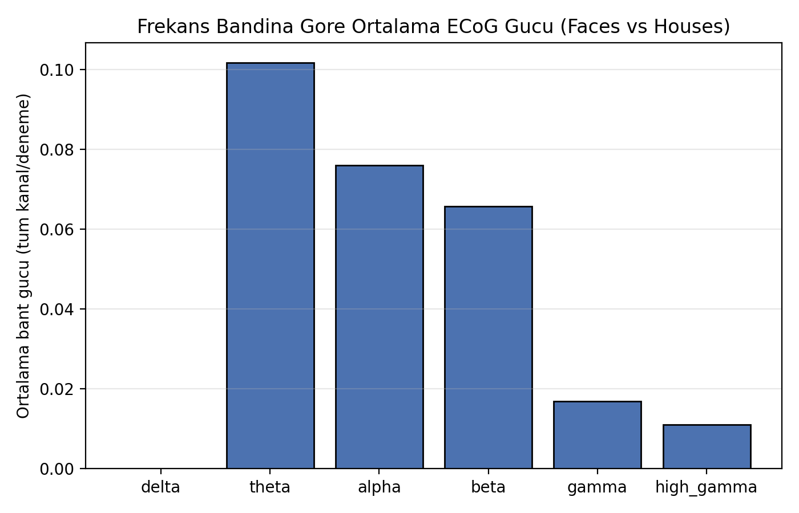
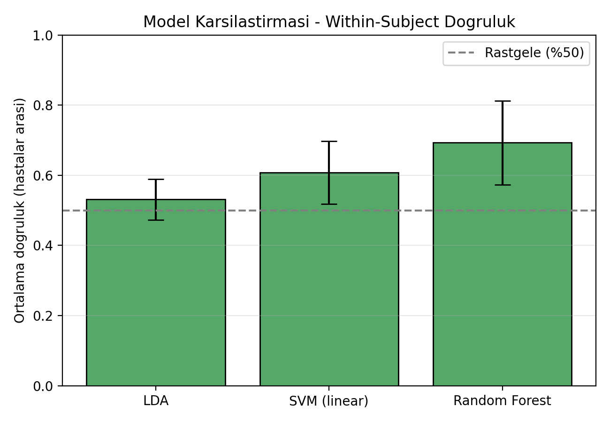

# ECoG Video Watching

Bu proje, epilepsi hastalarından intrakraniyal olarak toplanan ECoG (elektrokortikografi)
sinyallerinden, izlenen görsel uyaranın kategorisinin (yüz mü, ev mi) dekode edilmesini
amaçlar. Veri seti: Miller ve ark. (2017, 2019) "Faces vs Houses" pasif izleme deneyi —
her hastaya art arda yüz veya ev görselleri gösteriliyor, ECoG sinyali uyaran zamanlarıyla
hizalanıp frekans bandı özellikleri üzerinden sınıflandırılıyor.

**Durum:** Veri yükleme + ön işleme + frekans bandı özellik çıkarımı + LDA/SVM/RF
sınıflandırma + değerlendirme adımlarının hepsi kodlandı (bkz. `scripts/run_pipeline.py`)
ve **gerçek `faceshouses.npz` verisiyle (7 hasta) çalıştırıldı**. Sonuçlar
`reports/figures/` altında (bkz. aşağıdaki "Sonuçlar" bölümü).

Hastalar arası ortalama within-subject doğruluk (Stratified 5-Fold):

| Model | Doğruluk (ort. ± std) |
|---|---|
| LDA | 0.531 ± 0.058 |
| SVM (linear) | 0.608 ± 0.090 |
| Random Forest | 0.693 ± 0.120 |

Rastgele tahmin düzeyi %50 olduğuna göre üç model de bunun üzerinde; Random
Forest en güçlü sonucu veriyor ama hastalar arası varyans da en yüksek onda
(bazı hastalarda ~0.84, bazılarında ~0.50'ye yakın — muhtemelen elektrot
yerleşimi/kapsanan kortikal bölge farkına bağlı). Bant-gücü grafiği
(`band_power_summary.png`) düşük frekans bantlarının (theta/alpha/beta) ham
güçte baskın olduğunu gösteriyor; bu 1/f eğrisi nedeniyle beklenen bir durum
ve tek başına "ayırt edicilik" ile karıştırılmamalı — ayırt edicilik için
asıl belirleyici olan, modelin öğrendiği kanal×bant kombinasyonları.

## Amaç

- Ham ECoG (.mat) kayıtlarını işlenebilir hale getirmek
- Video içerik kategorilerini ECoG kayıtlarıyla zamansal olarak hizalamak/etiketlemek
- Sinyalden ayırt edici özellikler çıkarmak ve en bilgilendirici olanları seçmek
- Video içerik kategorisini sınıflandıran modeller eğitmek
- Model performansını değerlendirmek ve literatürdeki (SOTA) sonuçlarla karşılaştırmak
- Sonuçları görselleştirmek ve raporlamak

## İş Akışı

```
faceshouses.npz ──► Epoklama (stim onset etrafı) ──► Frekans bandı özellik çıkarımı
   ──► LDA / SVM / RF sınıflandırma ──► Stratified K-Fold değerlendirme
   ──► Bant-önemi + model karşılaştırma görselleri
```

## Proje Yapısı

```
data/
  raw/            faceshouses.npz buraya (bkz. data/raw/README.md)
  processed/      Ön işlenmiş / hizalanmış veri (opsiyonel ara çıktı)
notebooks/        Keşifsel analiz ve prototipleme not defterleri
src/
  data/           Veri yükleme (load_faceshouses.py, load_dataset.py)
  preprocessing/  Epoklama + baseline düzeltmesi (epoching.py)
  features/       Frekans bandı güç özelliği çıkarımı (bandpower.py)
  models/         LDA / SVM / RF pipeline tanımları (classify.py)
  evaluation/     Stratified K-Fold değerlendirme + confusion matrix/ROC (evaluate.py)
scripts/
  run_pipeline.py Uçtan uca pipeline (veri → özellik → sınıflandırma → görsel)
reports/
  figures/        Üretilen grafikler ve görselleştirmeler
requirements.txt  Python bağımlılıkları
```

## Kurulum

Python 3.11 önerilir.

```bash
python3.11 -m venv .venv
source .venv/bin/activate
pip install -r requirements.txt
```

## Çalıştırma

1. `data/raw/README.md` adımlarını izleyerek `faceshouses.npz` dosyasını indirin.
2. Uçtan uca pipeline'ı çalıştırın:
   ```bash
   python scripts/run_pipeline.py data/raw/faceshouses.npz
   ```
   Bu komut her hasta için ayrı ayrı (within-subject) Stratified 5-Fold ile
   LDA/SVM/RF doğruluğunu hesaplar, sonucu terminale yazar, ve
   `reports/figures/` altına iki grafik + `results.txt` kaydeder:
   - `band_power_summary.png` — hastalar arası ortalama bant gücü (delta...high_gamma)
   - `model_accuracy_summary.png` — LDA/SVM/RF doğruluklarının hastalar
     arası karşılaştırması
   - `results.txt` — sayısal özet (ortalama ± std ve hasta başına doğruluk)

## Sonuçlar

Gerçek `faceshouses.npz` verisiyle (7 hasta) çalıştırıldı:



