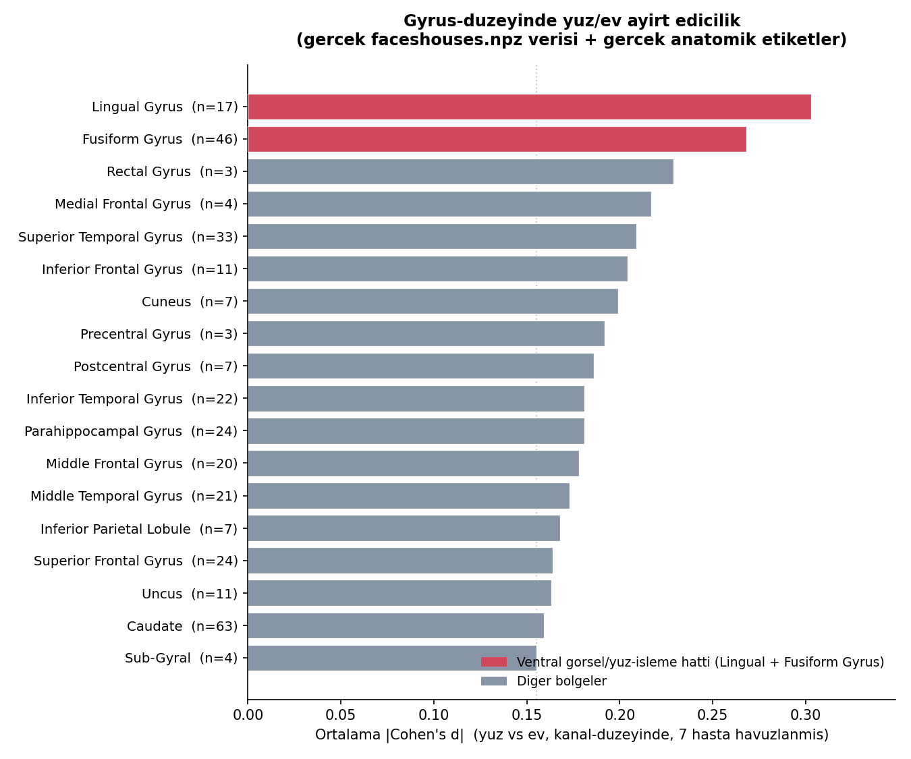
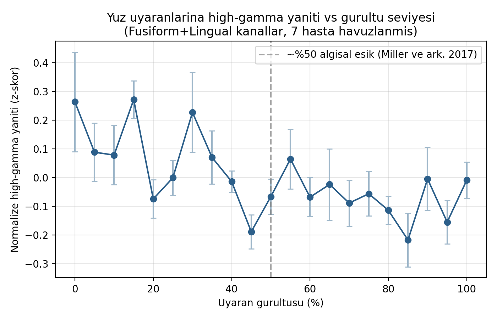

# ECoG Video Watching

Bu proje, epilepsi hastalarından intrakraniyal olarak toplanan ECoG (elektrokortikografi)
sinyallerinden, izlenen görsel uyaranın kategorisinin (yüz mü, ev mi) dekode edilmesini
amaçlar. Veri seti: Miller ve ark. (2017, 2019) "Faces vs Houses" pasif izleme deneyi —
her hastaya art arda yüz veya ev görselleri gösteriliyor, ECoG sinyali uyaran zamanlarıyla
hizalanıp frekans bandı özellikleri üzerinden sınıflandırılıyor. Kaynaklar için aşağıdaki
"Kaynaklar / Atıf" bölümüne bakın.

**Durum:** Veri yükleme + ön işleme + frekans bandı özellik çıkarımı + LDA/SVM/RF
sınıflandırma + değerlendirme adımlarının hepsi kodlandı (bkz. `scripts/run_pipeline.py`)
ve **gerçek `faceshouses.npz` verisiyle (7 hasta) çalıştırıldı**. Ayrıca sonuçların
*neden* hastalar arası bu kadar değiştiğini araştıran ek bir analiz de eklendi
(bkz. `analysis/` klasörü ve aşağıdaki "Ek Analiz" bölümü). Tüm sonuçlar
`reports/figures/` altında (bkz. aşağıdaki "Sonuçlar" bölümü).

Hastalar arası ortalama within-subject doğruluk (Stratified 5-Fold):

| Model | Doğruluk (ort. ± std) |
|---|---|
| LDA | 0.531 ± 0.058 |
| SVM (linear) | 0.608 ± 0.090 |
| Random Forest | 0.693 ± 0.120 |

Rastgele tahmin düzeyi %50 olduğuna göre üç model de bunun üzerinde; Random
Forest en güçlü sonucu veriyor ama hastalar arası varyans da en yüksek onda
(bazı hastalarda ~0.84, bazılarında ~0.50'ye yakın — bkz. "Ek Analiz" bölümü,
bu varyansın anatomik kapsama ile ilişkisi orada araştırıldı). Bant-gücü grafiği
(`band_power_summary.png`) düşük frekans bantlarının (theta/alpha/beta) ham
güçte baskın olduğunu gösteriyor; bu 1/f eğrisi nedeniyle beklenen bir durum
ve tek başına "ayırt edicilik" ile karıştırılmamalı — ayırt edicilik için
asıl belirleyici olan, modelin öğrendiği kanal×bant kombinasyonları.

## Amaç

- Ham ECoG (.mat) kayıtlarını işlenebilir hale getirmek
- Video içerik kategorilerini ECoG kayıtlarıyla zamansal olarak hizalamak/etiketlemek
- Sinyalden ayırt edici özellikler çıkarmak ve en bilgilendirici olanları seçmek
- Video içerik kategorisini sınıflandıran modeller eğitmek
- Model performansını değerlendirmek ve literatürdeki (SOTA) sonuçlarla karşılaştırmak
- Sonuçları görselleştirmek ve raporlamak

## İş Akışı

```
faceshouses.npz ──► Epoklama (stim onset etrafı) ──► Frekans bandı özellik çıkarımı
   ──► LDA / SVM / RF sınıflandırma ──► Stratified K-Fold değerlendirme
   ──► Bant-önemi + model karşılaştırma görselleri
```

## Proje Yapısı

```
data/
  raw/            faceshouses.npz buraya (bkz. data/raw/README.md)
  processed/      Ön işlenmiş / hizalanmış veri (opsiyonel ara çıktı)
notebooks/        Keşifsel analiz ve prototipleme not defterleri
src/
  data/           Veri yükleme (load_faceshouses.py, load_dataset.py)
  preprocessing/  Epoklama + baseline düzeltmesi (epoching.py)
  features/       Frekans bandı güç özelliği çıkarımı (bandpower.py)
  models/         LDA / SVM / RF pipeline tanımları (classify.py)
  evaluation/     Stratified K-Fold değerlendirme + confusion matrix/ROC (evaluate.py)
scripts/
  run_pipeline.py Uçtan uca pipeline (veri → özellik → sınıflandırma → görsel)
analysis/
  electrode_signal_localization.py    Hastalar arası doğruluk farkının anatomik
                                       kaynağını araştıran 4 adımlı analiz
  noise_threshold_replication.py      Miller ve ark. (2017) gürültü-eşiği bulgusunu
                                       tekrar üretme denemesi (dat2 ile)
  RESULTS.md                          İki analizin de yazılı özeti ve yorumu
reports/
  figures/        Üretilen grafikler ve görselleştirmeler
requirements.txt  Python bağımlılıkları
```

## Kurulum

Python 3.11 önerilir.

```bash
python3.11 -m venv .venv
source .venv/bin/activate
pip install -r requirements.txt
```

## Çalıştırma

1. `data/raw/README.md` adımlarını izleyerek `faceshouses.npz` dosyasını indirin.
2. Uçtan uca pipeline'ı çalıştırın:
   ```bash
   python scripts/run_pipeline.py data/raw/faceshouses.npz
   ```
   Bu komut her hasta için ayrı ayrı (within-subject) Stratified 5-Fold ile
   LDA/SVM/RF doğruluğunu hesaplar, sonucu terminale yazar, ve
   `reports/figures/` altına iki grafik + `results.txt` kaydeder:
   - `band_power_summary.png` — hastalar arası ortalama bant gücü (delta...high_gamma)
   - `model_accuracy_summary.png` — LDA/SVM/RF doğruluklarının hastalar
     arası karşılaştırması
   - `results.txt` — sayısal özet (ortalama ± std ve hasta başına doğruluk)
3. (Opsiyonel, ek analiz) Hastalar arası doğruluk farkının anatomik kaynağını
   incelemek için `analysis/electrode_signal_localization.py`, gürültü-eşiği
   replikasyonu için `analysis/noise_threshold_replication.py` çalıştırılabilir
   (ikisi de `data/raw/faceshouses.npz` gerektirir). Detaylı yazılı sonuçlar
   için `analysis/RESULTS.md`.

## Sonuçlar

Gerçek `faceshouses.npz` verisiyle (7 hasta) çalıştırıldı:


### Ek Analiz: hastalar arası doğruluk farkı nereden geliyor?

Random Forest doğruluğu hastalar arasında 0.50 ile 0.84 arasında değişiyor.
Bunun elektrot yerleşimiyle (yani hangi kortikal bölgelerin kapsandığıyla)
ilgili olup olmadığını, veri setinin **gerçek anatomik etiketlerini**
(`hemisphere`/`lobe`/`gyrus`/`Brodmann_Area`) kullanarak araştırdık.
Kanal-düzeyinde, tüm hastalar havuzlanarak hesaplanan ayırt edicilik
(ortalama |Cohen's d|, yüz vs ev) gyrus'a göre:



**Lingual Gyrus** (0.303) ve **Fusiform Gyrus** (0.268) — Miller ve ark.
(2017)'nin de yüz-algısı için işaret ettiği ventral görsel işleme hattı —
Frontal/Limbic/Parietal/Caudate gibi ilgisiz bölgelerden belirgin şekilde
daha yüksek ayırt edicilik gösteriyor. Yani sinyal *gerçekten* doğru
anatomik bölgede yoğunlaşıyor. Ancak hasta-bazlı "bu bölgeden kaç kanal var"
sayısı, n=7 ile, tek başına o hastanın genel doğruluğunu güvenilir şekilde
tahmin etmeye yetmiyor (kanal sayısı ≠ kanal kalitesi, ve örneklem küçük).
İki basit ama başarısız olan ara yöntem (literatür FFA-noktasına uzaklık,
kaba anatomik kutu içi kanal sayısı) de şeffaflık için analiz dosyasında
saklandı. Tüm adımların ayrıntısı: `analysis/RESULTS.md`.

### Ek Analiz: gürültü-eşiği bulgusunun kısmi replikasyonu

Miller ve ark. (2017), gürültü arttıkça yüz algısının belirli bir eşikten
sonra keskin biçimde bozulduğunu bildiriyor. Veri setinin daha önce
kullanılmayan `dat2` (gürültülü tespit görevi) kısmıyla, fusiform + lingual
kanallarındaki yüksek-gamma (70-150 Hz) tepkisini gürültü seviyesine göre
inceleyerek bu bulguyu tekrar üretmeyi denedik:



Sonuç, gürültü arttıkça genel bir düşüş eğilimi gösteriyor ama orijinal
makaledeki kadar keskin/temiz bir eşik basamağı vermiyor — muhtemelen daha
küçük örneklem ve daha basit bir tepki metriği kullanmamızdan kaynaklanıyor.
Dürüst/kısmi bir replikasyon olarak `analysis/RESULTS.md`'de belgelendi.

## Kaynaklar / Atıf

Bu proje aşağıdaki yayınlardaki veri setini ve bulguları temel alır:

1. Miller, K. J., Hermes, D., Pestilli, F., Wig, G. S., & Ojemann, J. G. (2017).
   **Face percept formation in human ventral temporal cortex.**
   *Journal of Neurophysiology*, 118(5), 2614–2627.
   https://doi.org/10.1152/jn.00113.2017
   ([PMC5668462](https://pmc.ncbi.nlm.nih.gov/articles/PMC5668462))

2. Miller, K. J. (2019).
   **A library of human electrocorticographic data and analyses.**
   *Nature Human Behaviour*, 3(11), 1225–1235.
   https://doi.org/10.1038/s41562-019-0678-3

Kullanılan `faceshouses.npz` dosyası, bu kütüphanenin Neuromatch Academy
tarafından hazırlanmış, doğrudan kullanıma hazır bir alt kümesidir (bkz.
`data/raw/README.md`). Ham/tam veri kütüphanesi Stanford Digital Repository'de
CC BY-SA 4.0 lisansıyla yayındadır: https://purl.stanford.edu/zk881ps0522
